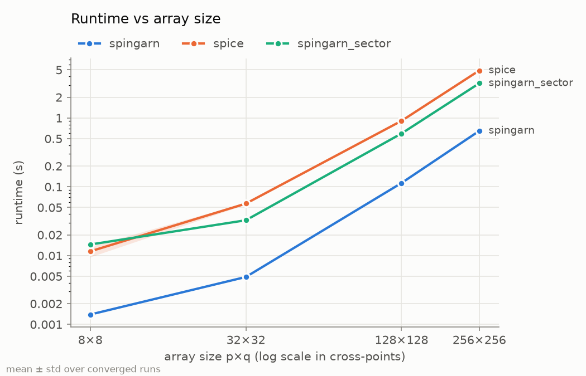
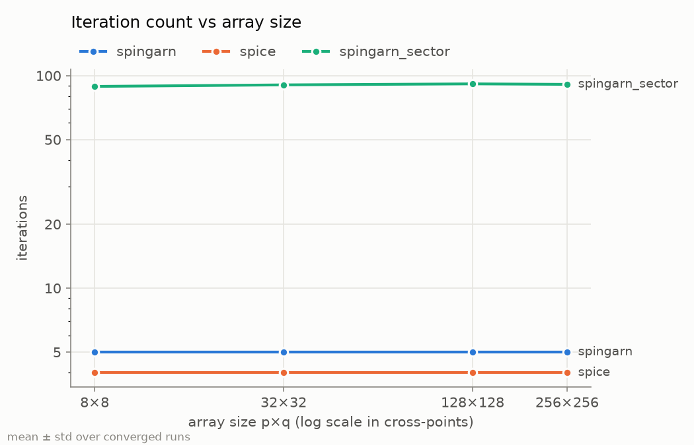
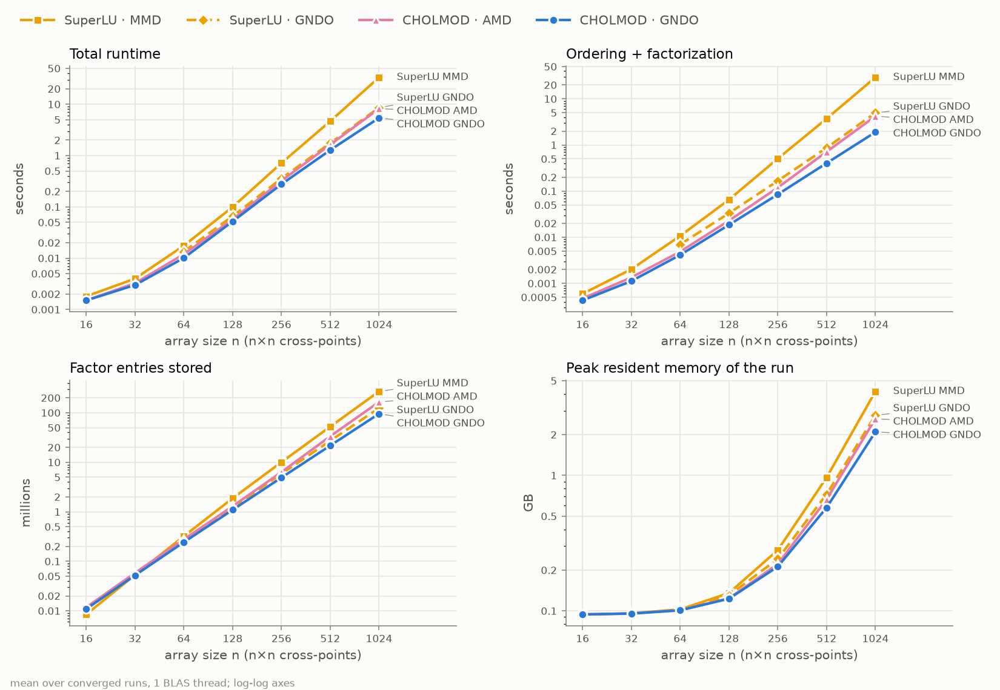

# Spingarn solver: implementation report

*2026-10-05. Covers the implementation of `SpingarnSolver.solve` from `instructions.md`, the design choices made along the way, the measurements behind them, and what remains open.*

*Update 2026-10-08: §6 adds a Cholesky factorization (CHOLMOD) in a geometric nested-dissection ordering, which is now the default. Throughout §1–5, `spingarn` and `spingarn_sector` mean the SuperLU versions; that solver is now registered as `spingarn_slu`. §6 was measured on a different machine from §3, so their runtimes and memory are not comparable.*

## Summary

- The iteration in `instructions.md` is implemented in [algorithms/spingarns.py](algorithms/spingarns.py) and passes 10 new tests in [testing/test_spingarn.py](testing/test_spingarn.py). The 15 existing tests still pass.
- **The iteration count does not depend on array size.** It stays the same from 1×1 to 1024×1024, a range of about 87,000× in cross-points. This is direct evidence for the README's claim that impedance-matching preconditioning keeps the iteration count roughly constant.
- **The choice of Γ for the memristive devices decides the iteration count.** Matching devices at $R_{min}$ takes **5 iterations**; matching at $\sqrt{R_{min}R_{max}}$ takes **85–92**. Following your decision, both are registered as separate solvers: `spingarn` ($R_{min}$) and `spingarn_sector` ($\sqrt{R_{min}R_{max}}$).
- **Spingarn is faster than SPICE at every size from 32×32 up.** At 1024×1024, `spingarn` takes 32 s and 3.75 GB, against SPICE/KLU's projected 6–7 min and 12–15 GB. At large sizes nearly all of Spingarn's runtime is a single sparse factorization, not the iterations.
- **The accuracy comparison with SPICE is not yet like-for-like.** SPICE at RELTOL 1e-3 actually returns KCL residuals around 1e-11, while Spingarn stops at its tolerance, around 1e-9. Tolerances need aligning before runtimes are compared as equal-accuracy results.
- **2026-10-08: CHOLMOD in a geometric nested-dissection ordering is now the default (§6).** At 1024×1024 it runs 6.2× faster than the SuperLU solver (5.4 s vs 33.4 s) and needs half the memory (2.1 GB vs 4.2 GB), measured on a different machine from the figures above. CHOLMOD does not do this ordering on its own. The ordering alone makes SuperLU 3.9× faster.

## 1. The algorithm as implemented

### 1.1 Wave variables

The circuit problem is to find branch voltages $v \in \mathrm{range}(A^T)$ (KVL) and branch currents $i \in \ker(A)$ (KCL) with $i_e = g_e(v_e)$ on every branch.

With a diagonal matrix $\Gamma$ of positive port resistances, branch $e$ carries:
- an incident wave $a_e = v_e + \gamma_e i_e$;
- a reflected wave $b_e = v_e - \gamma_e i_e$.

Starting from $a^0 = 0$, each iteration $k$ does two things:

1. **Scattering at the branches.** For each branch, $v^k = J_{\Gamma T}(a^k)$ and $b^k = 2v^k - a^k$, where $J_{\gamma_e T_e}$ solves $v + \gamma_e g_e(v) = a$.
2. **Scattering at the network.** $a^{k+1} = (1-\alpha)a^k + \alpha S_\Gamma b^k$, where $S_\Gamma = 2M_\Gamma - I$.

The output of iteration $k$ is $v^k$ and $i^k = \tfrac12\Gamma^{-1}(a^k - b^k)$. This pair satisfies the branch laws exactly at every iterate. KVL and KCL hold only at the fixed point.

At the fixed point, $a = S_\Gamma b$ implies:
- $v = M_\Gamma b \in \mathrm{range}(A^T)$, which is KVL;
- $\Gamma i = (M_\Gamma - I)b \in \Gamma\ker(A)$, which is KCL.

This confirms that the iteration in the instructions solves the circuit. With $\alpha = \tfrac12$ it is exactly Spingarn's method of partial inverses (equivalently Douglas–Rachford splitting of $T$ and the normal cone of $\mathrm{range}(A^T)$). Other values of $\alpha$ give its relaxed form.

### 1.2 The projection

$M_\Gamma b = A^T u$ with $u = (A\Gamma^{-1}A^T)^{-1} A\Gamma^{-1} b$.

- $L_\Gamma = A\Gamma^{-1}A^T$ is the nodal conductance matrix of the crossbar with every branch replaced by its port resistance.
- $L_\Gamma$ is symmetric positive definite, because the reduced incidence matrix has full row rank.
- Γ is fixed, so $L_\Gamma$ is factorized **once**. Each iteration then costs one pair of triangular solves.

A note on wording: the instructions call $M_\Gamma$ the projector "with the Γ weighted norm". As written, it is orthogonal in the inner product $\langle x, y\rangle = x^T\Gamma^{-1}y$, i.e. weighted by $\Gamma^{-1}$ rather than $\Gamma$.

The check: take $x = A^T u \in \mathrm{range}(A^T)$ and $y = \Gamma z$ with $Az = 0$. Then $x^T\Gamma^{-1}y = u^T A z = 0$. The formula is correct; only the name differs.

### 1.3 Why the iteration count can be size-independent

Scale the waves as $\tilde a = \Gamma^{-1/2}a$. In these variables:
- $S_\Gamma$ is an orthogonal reflection, which is an isometry;
- the branch reflection $a_e \mapsto b_e$ is Lipschitz with constant $\rho_e = \max_R |R-\gamma_e|/(R+\gamma_e)$, taken over branch $e$'s incremental resistances $R$.

With $\alpha = 1$, the iteration is therefore a contraction with factor $\max_e \rho_e$. For general $\alpha$ the factor is $(1-\alpha) + \alpha\max_e\rho_e$.

**This bound depends only on each branch's own resistance range, not on array size or topology.** A linear branch matched with $\gamma_e = R_e$ has $\rho_e = 0$: it absorbs its incident wave completely. The solver records this bound for every run as `history["contraction_bound"]`.

## 2. Choices made

### 2.1 Port resistances Γ (left "to be defined" in the instructions)

**Linear branches: $\gamma_e = R_e$.** This gives zero reflection and needs no choice. It covers wires, sources (an EMF in series with $R_{source}$) and loads.

**Devices:** the incremental resistance lies in $[R_{min}, R_{max}] = [1, 100]$ kΩ. Three rules were measured:

| rule | γ (default circuit) | a priori bound | iterations |
|---|---|---|---|
| `geometric`: $\sqrt{R_{min}R_{max}}$ | 10 kΩ | 0.818 (minimax over the whole sector) | 85–92 |
| `r_lo`: $R_{min}$ (zero-bias match) | 1 kΩ | 0.980 | **5** |
| operating range: $\sqrt{R_{inc}(0)\,R_{inc}(E_{max})}$ | ≈1.1 kΩ | ≈0.06 (proved via the no-gain property) | 7–8 |

The operating-range rule needs some explanation. All node potentials lie in $[0, \max E]$, because a monotone resistive network has no gain. So each device's incremental resistance is provably confined to $[R_{inc}(0), R_{inc}(E_{max})]$. Despite having the best proved bound, this rule was **worse in practice than `r_lo`**. The likely reason is that most devices sit near 0 V in the IR-drop region of the array, where $R_{min}$ matches them exactly. The iteration count follows the aggregate reflection across all devices, not the worst case. This rule was not added as an option.

**Decision (yours):** register both remaining rules as separate solvers.
- `spingarn`: `default_gamma = "r_lo"`.
- `spingarn_sector`: `default_gamma = "geometric"`.

Any instance can override its default with `gamma="r_lo"`, `"geometric"` or a resistance in ohms. `spingarn_sector` was appended last in `SOLVERS`, so `spingarn` and `spice` keep their plot colors (blue and orange) and the new solver gets green.

### 2.2 Relaxation α = 1 by default

- **Theory.** Every branch is strictly increasing ($g' \ge 1/R_{max} > 0$), so the $\alpha = 1$ map is already a contraction, and relaxation only weakens the bound: $(1-\alpha) + \alpha\rho$.
- **Measurement.** α = ½ took about twice the iterations: 182 vs 86 with geometric matching, 29 vs 4 with r_lo (4×4 case).
- **Exception.** α = ½ is Spingarn's original method and remains selectable. It would be needed for elements that are not strongly monotone, such as ideal diodes.

### 2.3 Device resolvent

$J_{\gamma T}$ for a device solves $c\,v + d\tanh v = a$, where $c = 1 + \gamma/R_{max}$ and $d = \gamma(1/R_{min} - 1/R_{max})$. There is no closed form, so it is solved elementwise by Newton's method, vectorized over all devices.

**Robustness argument.**
- The root has the sign of $a$.
- $x = |v|$ lies in $[\max(|a|/(c+d),\ (|a|-d)/c),\ |a|/c]$.
- The left-hand side is concave for $x \ge 0$.
- Therefore one Newton step clipped to that interval lands at or below the root, and from there the iterates rise monotonically to it.

**Implementation details.**
- Each solve is warm-started from the previous outer iteration's device voltages.
- It stops when every step is at most $10^{-12}|x|$. Convergence is quadratic, so the result is then exact to rounding.
- A `RuntimeError` is raised after 100 steps. This should be unreachable; it is a bug detector.

**Measured.** Over $a \in [-200, 200]$, $\gamma$ from 5 Ω to 1 MΩ and adversarial warm starts (wrong side, wrong sign):
- worst residual: $1.6\times10^{-16}$ relative;
- worst case: 7 Newton steps;
- typical: about 2.5 steps per outer iteration.

The device law is written out in the solver, as SPICE's netlist writer also does. The test against the Newton reference, which uses `Config.current`, catches any drift between the two.

**Linear branches** use the closed form $v = (aR + \gamma\,\mathrm{emf})/(R+\gamma)$.

### 2.4 Linear solver: SuperLU, minimum-degree ordering, symmetric mode

*Since 2026-10-08 this is the legacy solver `spingarn_slu`; the default is CHOLMOD in a geometric nested-dissection ordering (§6).*

**Why SuperLU.** scipy 1.18 here offers only SuperLU (`splu`); CHOLMOD and UMFPACK are not installed.

**Settings.**
- `permc_spec="MMD_AT_PLUS_A"`: minimum-degree ordering on $A + A^T$.
- `diag_pivot_thresh=0`: no pivoting, which is safe because $L_\Gamma$ is SPD.
- `SymmetricMode=True`.

Together these keep the ordering symmetric. Against COLAMD, they give about 25% less fill and 1.7× faster solves:

| size | factor | solve | fill (MMD) | fill (COLAMD) |
|---|---|---|---|---|
| 64×64 | 0.012 s | 0.29 ms | 9.9× | 12.4× |
| 256×256 | 0.51 s | 9.3 ms | 19.2× | 25.1× |
| 512×512 | 3.8 s | 42 ms | 25.0× | — |
| 1024×1024 | 29.2 s | 215 ms | 32.2× (270M nnz) | — |

Factorization time grows as about $n^{1.45}$, close to the $n^{1.5}$ expected for a 2-D grid. The solver records `lu.nnz` as `history["factor_nnz"]`. This counts SuperLU's supernodal storage and is free to read; reading `lu.L` and `lu.U` would copy the factors.

### 2.5 Stopping rule (unspecified in the instructions)

**Rule.** The output $(v^k, i^k)$ already satisfies the branch laws, so it is tested on the two constraints it meets only in the limit. Both tests use the relative tolerance `tol`:

- **KCL:** SPICE's own acceptance test, `kcl_check`, applied to the node potentials $u$ of $v^k$. The test is $|\sum i| \le \text{tol}\cdot\sum|i| + \text{abstol}$ at every node.
  - These potentials cost no extra solve. Since $M_\Gamma v^k = \tfrac12(M_\Gamma a^k + M_\Gamma b^k)$, and $M_\Gamma S_\Gamma = M_\Gamma$, the node-space form $w^k$ of $M_\Gamma a^k$ follows the recursion $w^{k+1} = (1-\alpha)w^k + \alpha u_b^k$. Here $u_b^k$ comes out of the projection already computed for $S_\Gamma b^k$.
- **KVL:** $\max_e |v^k_e - (A^Tu)_e| \le \text{tol}\cdot\max_e|v^k_e|$.

**Why this rule.**
- **Same meaning for both solvers.** "Converged" now means the same thing for Spingarn and SPICE: SPICE's answer is also accepted only after `kcl_check`.
- **The KVL test is necessary.** With matched linear branches, the KCL test on the projected potentials cannot see the KVL error of $v^k$, even to first order. If $v^k = A^Tu + \Gamma z$ with $Az = 0$, the currents change by $\Gamma^{-1}\Gamma z = z$, which is invisible to $A$.
- **The fixed-point residual alone would stop too early.** $\|S_\Gamma b^k - a^k\|_{\Gamma^{-1}}$ is exactly the combined KVL and KCL violation in the power-wave norm. But it underestimates the error by roughly $1/(1-\rho)$. In the prototype it reached 1e-9 about 10 iterations before the true error did (76 vs 86 at 4×4; 80 vs 89 at 64×64, geometric matching). The KCL and KVL tests tracked the true error to within a few iterations, or were slightly conservative.

**Implementation notes.**
- `kcl_check` moved from `spice.py` to [algorithms/common.py](algorithms/common.py), with an optional precomputed incidence matrix. `spice.py` re-imports it, so `from algorithms.spice import kcl_check` still works.
- `abstol` defaults to SPICE's 1e-12 A.

### 2.6 Output, iteration count, history

- **Output.** $(v^k, i^k)$ exactly as in the instructions. A non-converged run returns its last iterate.
- **Iteration count.** Passes of the loop, i.e. linear solves ($k+1$ at detection). This matches Newton's solve-then-confirm convention: a fully matched linear circuit reports 2.
- **History fields.**
  - Timing and factorization: `setup_time`, `iteration_time`, `factor_nnz`, `contraction_bound`, `newton_steps`.
  - Final residuals, using the same keys as SPICE where they overlap: `kcl_residual`, `kcl_residual_rel`, `kvl_residual_rel`.
  - Per-iteration lists: `kcl_history`, `kvl_history`, `fixed_point_history`.
- **Validation.** Bad `gamma` or `alpha` values, or `max_iterations < 1`, raise `ValueError`.

## 3. Findings

### 3.1 Iteration count vs size (tol 1e-9, α = 1, E ∈ [0.1, 0.5] V)

| size | 2×2 | 4×4 | 8×8 | 16×16 | 32×32 | 64×64 | 128×128 | 256×256 | 512×512 | 1024×1024 |
|---|---|---|---|---|---|---|---|---|---|---|
| `spingarn` | 5 | 5 | 5 | 5 | 5 | 5 | 5 | 5 | 5 | 5 |
| `spingarn_sector` | 88 | 87 | 89 | 91 | 91 | 91 | 92 | 91 | 91 | 91 |

**Observed contraction rates:**
- `spingarn_sector`: about 0.796 per iteration, just under its 0.818 bound.
- `spingarn`: about 0.006 per iteration, far below its 0.98 bound. Section 4.4 discusses why.

### 3.2 Robustness to the operating point

Higher source voltages push more devices toward saturation:

| E range | `spingarn_sector` | `spingarn` | operating-range rule |
|---|---|---|---|
| 0.1–0.5 V | 89–91 | 5 | 7–8 |
| 0.5–1.5 V | 84–87 | 7–8 | 18–20 |
| 1.0–3.0 V | 81–86 | 11–15 | 53–61 |

Every cell holds for 8×8, 64×64 and 256×256 alike, so size-independence holds at every operating point tested.

### 3.3 Runtime and memory

These are full solves; runtime is the whole `solve()` call, consistent with the existing runtime decision.

| size | `spingarn` | `spingarn_sector` | SPICE/KLU | peak memory (Spingarn) |
|---|---|---|---|---|
| 8×8 | 0.001 s | 0.014 s | 0.012 s | — |
| 32×32 | 0.005 s | 0.033 s | 0.057 s | — |
| 128×128 | 0.11 s | 0.59 s | 0.91 s | — |
| 256×256 | 0.65 s | 3.2 s | 4.9 s | — |
| 512×512 | 4.4 s | 15.3 s | 41 s (earlier baseline) | 0.84 GB |
| 1024×1024 | **32 s** | 78 s | ~6–7 min projected | **3.75 GB** (SPICE: 12–15 GB projected) |

Where the time goes at 1024×1024:
- **Factorization:** 29 s, the bulk of the total.
- **Each iteration:** about 0.54 s, made up of the 215 ms triangular solve plus O(n) work.

Plots from a 3-solver sweep through the experiment runner (sizes 8–256, 2 seeds each). The command to regenerate them is `python run_experiments.py --sizes 8 32 128 256 --runs 2`:




### 3.4 Per-iteration cost breakdown

Profile at 256×256 with `spingarn_sector` (91 iterations, 3.1 s total):

| part | total | per iteration |
|---|---|---|
| factorization (once) | 0.49 s | — |
| triangular solves | 0.78 s | 8.6 ms |
| numpy vector work in the loop | 0.81 s | 8.9 ms |
| KCL check (incl. `cfg.current`, `abs(A)`) | 0.50 s | 5.5 ms |
| device resolvent | 0.42 s | 4.6 ms |

**The triangular solve is only about 30% of each iteration.** The rest is O(n) overhead that has not been optimized. It matters little for `spingarn` (5 iterations) but noticeably for `spingarn_sector`.

### 3.5 Agreement and accuracy

**Agreement.** Against an independent Newton solve, the voltage error is below 1e-8 relative at every size and setting tested; at the default tolerance it is typically 1e-10 to 2e-9. The branch laws hold to about 1e-15. On identical circuits, the maximum relative difference from SPICE is:

| size | `spingarn` | `spingarn_sector` |
|---|---|---|
| 16×16 | 8e-11 | 8.5e-10 |
| 64×64 | 1.0e-10 | 8.0e-10 |
| 256×256 | 1.0e-10 | 8.4e-10 |

**Final KCL residuals (`kcl_residual_rel`):**

| size | SPICE | `spingarn` | `spingarn_sector` |
|---|---|---|---|
| 16×16 | 6.5e-13 | 7e-11 | 7e-10 |
| 64×64 | 1.7e-11 | 1.6e-10 | 5.0e-9 |
| 256×256 | 3.6e-11 | 1.9e-10 | 3.5e-9 |

Newton's final quadratic step overshoots SPICE's RELTOL of 1e-3 by many orders of magnitude, while Spingarn stops close to its tolerance.

**The absolute tolerance often decides the KCL test.** At tol 1e-9, `abstol` = 1 pA rather than the relative term binds at any node carrying under 1 mA. So converged runs can report `kcl_residual_rel` above tol:
- 6.9e-8 at 512×512 (`spingarn_sector`);
- 1.9e-6 at 1024×1024 (`spingarn_sector`), at nodes carrying about 0.5 µA.

Those nodes sit in the far region, where IR drop on 1024-cell lines (5 Ω wires) leaves the devices with almost no voltage. Without `abstol`, rounding error alone would put the relative residual at such nodes around 1e-11, so some absolute floor is necessary.

### 3.6 Fully matched linear circuit

With $R_{min} = R_{max}$, every branch is matched and the contraction bound is 0. The reflected waves then do not depend on the incident ones, so the first update lands exactly on the solution. The run reports 2 iterations (solve, then confirm), with error below 1e-12. This is a direct check of the impedance-matching principle and is one of the tests.

## 4. Not implemented / open questions / next steps

### 4.1 Comparison methodology (most important before drawing conclusions)

1. **Align accuracy before comparing runtimes.** SPICE effectively delivers about 1e-11 at RELTOL 1e-3. Either:
   - run Spingarn at about 1e-11 (estimated cost: roughly +1 iteration for `spingarn`, roughly +21 for `spingarn_sector`); or
   - compare at matched final `kcl_residual_rel` rather than matched nominal tolerances.
2. **Decide abstol semantics for tight tolerances.** Keep SPICE's 1 pA, scale it with the circuit's current level, or report both the relative and absolute residuals. This interacts with the tolerance tuning you planned.
3. **Run multiple seeds through the runner at 512 and 1024.** All large-size numbers above come from single seed-0 runs outside the runner.
4. **Fill in the missing SPICE points.** The 1024×1024 SPICE figure is still a projection. Run it with `--timeout` to get the measured point, or the measured memory failure.

### 4.2 Performance

5. **Trim the per-iteration overhead.** Candidate fixes:
   - precompute $|A|$ instead of rebuilding it inside every `kcl_check` call;
   - fuse and do in place the vector updates;
   - make `fixed_point_history` optional (it is diagnostic only);
   - restrict the resolvent's Newton loop to unconverged entries.

   Expected gain is about 2× per iteration at mid sizes, which matters mainly for `spingarn_sector`.
6. **Better orderings or factorizations.** *Done 2026-10-08, see §6:* CHOLMOD (through cvxopt, as scikit-sparse has no Windows wheel) in a geometric nested-dissection ordering. Multithreading turned out to slow CHOLMOD down on the current machine (§6.4).
7. **2048×2048 is untested.** Expect about 18 GB and about 4 min of factorization. SuperLU's 32-bit indices may become a hard limit near 2 billion stored nonzeros. This is the size where SPICE is expected to run out of memory, so it is the most interesting point for the project's hypothesis.

### 4.3 Generality

8. **Other elements (e.g. diodes)** need their own resolvent. The current one is specific to the tanh device. The linear closed form, the projection and the convergence tests are already generic. A safeguarded Newton step using the branch's sector bounds would extend to any monotone element: since the resolvent equation has slope ≥ 1, its residual bounds its error.
9. **Elements that are not strongly monotone** (ideal diodes, open circuits) break the α = 1 contraction argument. Those need α < 1, and the stopping rule would need re-checking.
10. **Only the crossbar topology has been tested.** The README claims topology-independence too. Testing it needs at least one other network family.
11. **Adaptive Γ was not attempted.** Re-matching each device to its current incremental resistance would require refactorizing $L_\Gamma$ and turns the method into a variable-metric scheme, where convergence theory is less settled. Fixed Γ is the clean case.

### 4.4 Theory

12. **Why `spingarn` beats its bound by about 160×.** It contracts at about 0.006 per iteration against a worst-case bound of 0.98. A plausible explanation: matched wires absorb most of each device's reflected wave, so little of it returns to devices, and the true rate is governed by the device-to-device block of $S_\Gamma$ times the local reflection factors rather than by $\max_e\rho_e$. Making this precise, e.g. via the spectral radius of the linearized map $S_\Gamma D_\rho$, would turn the empirical result into a provable statement.

### 4.5 Housekeeping

13. **History size.** A run that hits the 10,000-iteration budget stores three 10,000-entry lists in `runs.jsonl`, about 0.6 MB per record. This has not happened in practice yet.
14. **README tests line.** It lists `test_config`, `test_experiments` and `test_spingarn`, but not `test_spice` (which needs the ngspice setup). Left as it was.
15. **Nothing is committed.** Your pre-existing `# type: ignore` change in `spice.py` is untouched.

## 5. Files changed

| file | change |
|---|---|
| [algorithms/spingarns.py](algorithms/spingarns.py) | `port_resistances`, `contraction_bound`, `device_resolvent`, `SpingarnSolver.solve`, `SpingarnSectorSolver` |
| [algorithms/common.py](algorithms/common.py) | `kcl_check` moved here, with optional precomputed `A` |
| [algorithms/spice.py](algorithms/spice.py) | imports `kcl_check` from `common` |
| [algorithms/__init__.py](algorithms/__init__.py) | registers `spingarn_sector` (appended, so existing plot colors are unchanged) |
| [testing/test_spingarn.py](testing/test_spingarn.py) | 10 tests (see below) |
| README.md | Spingarn section; new test file; the example `--algorithms` list (still UTF-16 LE) |
| memory/ | new `spingarn-solver-findings.md`; index line; `working-feedback-style.md` example replaced (the cross-project rho note was removed, as you asked) |

What the 10 tests cover:
- agreement with the Newton reference for every Γ rule and α;
- resolvent accuracy, including adversarial warm starts;
- Γ rules;
- the one-update solve of a matched linear circuit;
- size-independence of the iteration count;
- zero sources;
- stopping at the iteration budget;
- rejection of bad options;
- registry defaults;
- a sweep through the runner with both variants.

## 6. Cholesky and geometric nested dissection (2026-10-08)

*Measured on an 8-core laptop (Intel Core Ultra 7 256V: 4 performance and 4 low-power cores, 15.5 GB RAM), not on the 32 GB machine of §3, so runtimes and memory here are not comparable with §3's. SPICE is not part of this comparison: ngspice is not installed on this machine, by your choice.*

### 6.1 What changed

- **New default.** `spingarn` and `spingarn_sector` now factorize $L_\Gamma$ with CHOLMOD's supernodal Cholesky, $L_\Gamma = LL^T$, in a geometric nested-dissection ordering (GNDO) computed from the crossbar's grid.
- **Legacy.** The SuperLU solver of §2.4 is kept unchanged as `spingarn_slu`.
- **Control.** `spingarn_cholmod` is CHOLMOD with its own ordering, so comparing it with `spingarn` isolates what GNDO adds.
- **Options**, for any variant through `--options`:
  - `factorization`: `"cholmod"` or `"slu"`;
  - `ordering`: `"nested_dissection"`, or `"builtin"` for the library's own;
  - `blas_threads`: default 1 (§6.4).
- **Why cvxopt.** SciPy 1.18 has no sparse Cholesky. scikit-sparse, the usual CHOLMOD binding, ships only a source package for Windows, and this machine has no C compiler. cvxopt 1.3.3 ships a Python 3.14 Windows wheel that contains CHOLMOD (SuiteSparse 7.11, 64-bit indices) and its own OpenBLAS, and it accepts a user permutation.
- **New run history fields:**
  - `ordering_time`, `factor_time`, `ordering_used` and `blas_threads`;
  - for CHOLMOD, also `cholmod_ordering` and `lnz`, the exact nonzeros of $L$.
  - `factor_nnz` now means entries stored: $L$ and $U$ for SuperLU, $L$ with its supernodal padding for CHOLMOD.
- **Runner.** Every isolated run records its process's peak resident memory (`peak_memory`), plotted as `memory.png`.

### 6.2 Does CHOLMOD do nested dissection by itself?

**No. GNDO is an extra step.** CHOLMOD sees only the matrix, never the grid, so it cannot do *geometric* nested dissection.
- Its default ordering is AMD, an approximate minimum-degree method like SuperLU's MMD.
- Builds that include METIS can also try *algebraic* nested dissection, with separators found by a graph partitioner. cvxopt's build leaves METIS out, so here CHOLMOD on its own always uses AMD.
- GNDO is passed to CHOLMOD as a permutation with `nmethods = 1`, which makes CHOLMOD use it as given instead of comparing it with AMD and keeping the better one.

The runs confirm this. cvxopt does not expose the factor's statistics, so the solver reads CHOLMOD's own `cholmod_factor` struct through ctypes, checking each field's plausibility first. Left to itself, CHOLMOD reports ordering `amd`. Given GNDO, it reports `given`. A test checks both.

### 6.3 The ordering

Implemented in [algorithms/ordering.py](algorithms/ordering.py).

- **Separators.** Each cross-point holds a word node and a bit node. Only word wires join neighbouring columns, and only bit wires join neighbouring rows. So a vertical cut needs only the $p$ word nodes of one column, and a horizontal cut only the $q$ bit nodes of one row. The separators are as small as on a grid with one node per cross-point.
- **Stranded lines.** A vertical cut leaves the bit nodes of the cut column joined to neither half. They stay with the left half, where later horizontal cuts split them. A horizontal cut's word row stays with the top half in the same way.
- **Recursion.** Each region is cut across its longer side, at the middle. The first half is ordered, then the second, then the separator. Regions of at most 64 nodes are numbered in natural order.
- **Correctness.** A test checks every split, down to single nodes, on seven shapes including 1×9, 9×1 and 13×7. At each split, the separator and the two halves partition the region, and no branch joins the halves.

**Leaf size.** Measured at 1024×1024 with CHOLMOD on 1 thread, medians of 3:

| leaf (nodes) | ordering | symbolic | numeric | total | one solve | nonzeros of $L$ | stored |
|---|---|---|---|---|---|---|---|
| CHOLMOD's AMD | (in symbolic) | 0.89 s | 2.92 s | 3.81 s | 172 ms | 116.6M | 165.1M |
| 16 | 0.36 s | 0.42 s | 1.08 s | 1.86 s | 140 ms | 58.8M | 99.3M |
| 32 | 0.20 s | 0.42 s | 1.07 s | 1.69 s | 138 ms | 60.1M | 99.5M |
| **64** | 0.13 s | 0.43 s | 1.07 s | **1.63 s** | 136 ms | 62.2M | **95.6M** |
| 128 | 0.10 s | 0.42 s | 1.09 s | 1.60 s | 136 ms | 67.9M | 103.8M |

- **The numeric factorization doesn't depend on leaf size.** It is the same from 16 to 128 nodes.
- **Larger leaves trade ordering time for fill.** They make the Python ordering cheaper but add fill.
- **64 is the chosen default.** It stores the fewest entries, because CHOLMOD pads and merges supernodes differently, and it is within 2% of the fastest total.

### 6.4 BLAS threads

cvxopt's OpenBLAS uses every core by default, and on this machine that made CHOLMOD several times slower. Numeric factorization with AMD, one process per thread count, 3 repeats:

| size | 1 thread | 2 | 4 | 8 (default) |
|---|---|---|---|---|
| 256×256 | 0.095–0.106 s | — | 0.35–0.49 s | 1.00–1.11 s |
| 512×512 | 0.98–1.03 s | 0.90–0.97 s | 0.97–1.32 s | 2.21–3.01 s |
| 1024×1024 | 4.57–4.80 s | 3.64–3.75 s | 5.38–5.59 s | 9.35–9.64 s |

- **Likely cause.** Most supernodes are small, so splitting their dense kernels across threads costs more in synchronization than it saves. Beyond 2 threads, work also lands on the slow low-power cores, and the fast cores wait for them.
- **Decision (yours).** `blas_threads = 1` by default. SuperLU is single-threaded, so this also keeps the comparison like for like. A second thread's effect is measured in §6.5.
- **Absolute times drift.** This table was measured while the machine was slower than for the leaf-size table above (AMD's numeric factorization at 1024: 4.6 s here, 2.9 s there), so compare within a table, not across tables.

### 6.5 Results

**Setup.** Three runner sweeps, 3 seeds per size, each run in its own process, 1 BLAS thread unless noted:

```
python run_experiments.py --sizes 16 32 64 128 256 512 1024 --runs 3 --algorithms spingarn_slu spingarn_cholmod spingarn --no-pickle --out results/factorization
python run_experiments.py --sizes 64 128 256 512 1024 --runs 3 --algorithms spingarn_slu --options '{"spingarn_slu": {"ordering": "nested_dissection"}}' --no-pickle --out results/slu_nd
python run_experiments.py --sizes 256 512 1024 --runs 3 --algorithms spingarn_cholmod spingarn --options '{"spingarn_cholmod": {"blas_threads": 2}, "spingarn": {"blas_threads": 2}}' --no-pickle --out results/cholmod_2threads
python compare_factorizations.py results/factorization results/slu_nd results/cholmod_2threads
```

All 96 runs converged in 5 iterations. Answers agree across backends to about 3e-12 (a test checks this at 32×32).



**Total runtime (s)**, mean over 3 seeds. The standard deviation is within 6% of the mean from 64×64 up and within 1% at 1024×1024, but reaches 18% at 16×16, where a run takes 2 ms:

| size | SuperLU · MMD (`spingarn_slu`) | SuperLU · GNDO | CHOLMOD · AMD (`spingarn_cholmod`) | CHOLMOD · GNDO (`spingarn`) |
|---|---|---|---|---|
| 16×16 | 0.0018 | — | 0.0015 | 0.0015 |
| 32×32 | 0.0040 | — | 0.0033 | 0.0030 |
| 64×64 | 0.018 | 0.014 | 0.012 | 0.010 |
| 128×128 | 0.10 | 0.066 | 0.057 | 0.052 |
| 256×256 | 0.71 | 0.36 | 0.32 | 0.28 |
| 512×512 | 4.67 | 1.75 | 1.63 | 1.28 |
| 1024×1024 | 33.4 | 8.61 | 8.22 | **5.42** |

**At 1024×1024:**

| | SuperLU · MMD | SuperLU · GNDO | CHOLMOD · AMD | CHOLMOD · GNDO |
|---|---|---|---|---|
| ordering + factorization | 29.2 s | 5.00 s | 4.21 s | **1.90 s** |
| time per iteration | 690 ms | 598 ms | 678 ms | 591 ms |
| factor entries stored | 270M (L+U) | 124M (L+U) | 165M | **95.6M** |
| nonzeros of $L$ | — | — | 117M | **62.2M** |
| peak resident memory | 4.17 GB | 2.78 GB | 2.62 GB | **2.10 GB** |

**What GNDO adds**, as the library's own ordering ÷ GNDO (above 1: GNDO is better):

| size | CHOLMOD runtime | CHOLMOD ordering + factorization | CHOLMOD nonzeros of $L$ | CHOLMOD memory | SuperLU runtime | SuperLU ordering + factorization | SuperLU memory |
|---|---|---|---|---|---|---|---|
| 256×256 | 1.16× | 1.40× | 1.28× | 1.04× | 2.00× | 3.03× | 1.16× |
| 512×512 | 1.28× | 1.76× | 1.59× | 1.15× | 2.67× | 4.28× | 1.33× |
| 1024×1024 | 1.52× | 2.22× | 1.88× | 1.25× | 3.88× | 5.85× | 1.50× |

- **The ordering is the larger of the two changes.** From the legacy solver to the new default, runtime at 1024×1024 falls 6.2×:
  - GNDO alone accounts for 3.9×, from SuperLU/MMD to SuperLU/GNDO;
  - Cholesky adds a further 1.6×, from SuperLU/GNDO to CHOLMOD/GNDO.
- **GNDO's advantage grows with size.** Within CHOLMOD, its factorization speedup rises from 1.40× at 256 to 1.76× at 512 and 2.22× at 1024.
- **Memory halves.** CHOLMOD/GNDO peaks at 2.10 GB at 1024×1024, against 4.17 GB for SuperLU/MMD. About 0.1 GB of every figure is the interpreter and its libraries.
- **Small arrays gain little.** Below 64×64 every variant finishes in 2–4 ms, so the differences don't matter in practice. At 16×16, GNDO's $L$ even has slightly more nonzeros than AMD's, because a whole array that small is a few leaves numbered in natural order.

**Scaling**, as log-log slopes over 128×128 to 1024×1024, with nodes $N = 2n^2$:

| configuration | ordering + factorization ∝ $N$^ | nonzeros of $L$ ∝ $N$^ | stored ∝ $N$^ | ordering + factorization ∝ stored^ |
|---|---|---|---|---|
| SuperLU · MMD | 1.46 | — | 1.19 | 1.23 |
| SuperLU · GNDO | 1.20 | — | 1.11 | 1.08 |
| CHOLMOD · AMD | 1.26 | 1.24 | 1.17 | 1.08 |
| CHOLMOD · GNDO | 1.11 | 1.11 | 1.07 | 1.04 |

- **GNDO's fill follows $N \log N$.** Over this range, $N \log N$ has a local slope of 1.07–1.09, and the measured slope is 1.11. AMD's fill grows faster, at 1.24.
- **SuperLU/MMD matches §2.4.** Its factorization slope of 1.46 agrees with the 1.45 measured on the other machine.
- **Scaling against nonzeros.** This answers the meeting note on checking scaling against nonzeros as well as $N$: CHOLMOD's factorization time is close to linear in the entries it stores (slope 1.04–1.08), while SuperLU/MMD's grows faster (1.23).
- **These are local slopes, not asymptotes.** Nested dissection's flops grow as $N^{1.5}$, but at these sizes CHOLMOD/GNDO's time still tracks its fill, so its slope should rise toward 1.5 on larger arrays.

**BLAS threads.** A second thread changed total runtime by at most 2%, and the factorization by 0.95–1.09×, at every size from 256 to 1024. So 1 thread stays the default.

### 6.6 What this means, and next steps

1. **The factorization is no longer the bottleneck.** At 1024×1024, `spingarn` spends 1.9 s factorizing and about 3.0 s in its 5 iterations. An iteration takes 591 ms, of which the triangular solve is only about 136 ms (§6.3). §4.2 item 5, the per-iteration overhead, is now the bigger lever, above all for `spingarn_sector` with its ~91 iterations.
2. **2048×2048 now looks feasible here.** It wasn't run, since you chose to stop at 1024. Extrapolating the measured growth in peak memory from 512 to 1024 (3.6× for CHOLMOD/GNDO, 4.3× for SuperLU/MMD per 4× nodes):
   - CHOLMOD/GNDO would need about 8 GB, which fits in this machine's 15.5 GB;
   - SuperLU/MMD would need about 18 GB, matching §4.2 item 7's projection.
3. **The SPICE comparison is still to do.** It needs ngspice on this machine, since §3's SPICE numbers come from the other machine.
4. **Re-check the thread default on other hardware.** It was measured on this laptop's mix of fast and slow cores.
5. **Compare `factor_nnz` only within one library.** It counts $L$ and $U$ for SuperLU but $L$ alone for CHOLMOD. Across libraries, compare `lnz` (CHOLMOD only) or peak memory.

### 6.7 Files changed (2026-10-08)

| file | change |
|---|---|
| [algorithms/ordering.py](algorithms/ordering.py) | new: `nested_dissection` |
| [algorithms/spingarns.py](algorithms/spingarns.py) | `factorize`, `cholmod_factor_stats`, `blas_threads`; options `factorization`, `ordering`, `blas_threads`; `SpingarnSLUSolver`, `SpingarnCholmodSolver` |
| [algorithms/__init__.py](algorithms/__init__.py) | registers `spingarn_slu` and `spingarn_cholmod`, appended so existing plot colors are unchanged |
| [run_experiments.py](run_experiments.py) | `peak_memory` per isolated run; cvxopt version in `experiment.json` |
| [plotting.py](plotting.py) | peak memory in `summary.json` and `memory.png` |
| [compare_factorizations.py](compare_factorizations.py) | new: the tables and figure of §6.5 |
| [testing/test_ordering.py](testing/test_ordering.py) | new: 5 tests |
| [testing/test_spingarn.py](testing/test_spingarn.py) | 13 tests (was 10), covering all backends against Newton, `factorize` in any ordering, CHOLMOD's readback and fill, thread control, and the registry |
| [testing/test_experiments.py](testing/test_experiments.py) | peak memory is recorded for isolated runs only |
| requirements.txt | adds cvxopt |
| README.md | variants, options and the tests line (still UTF-16 LE) |
| memory/ | `python-environment.md` updated; `measurement-machine.md` new; `spingarn-solver-findings.md` updated |

Nothing is committed.
