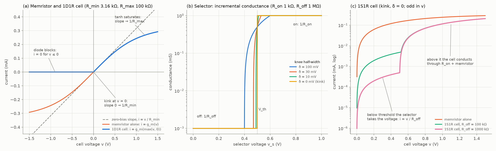
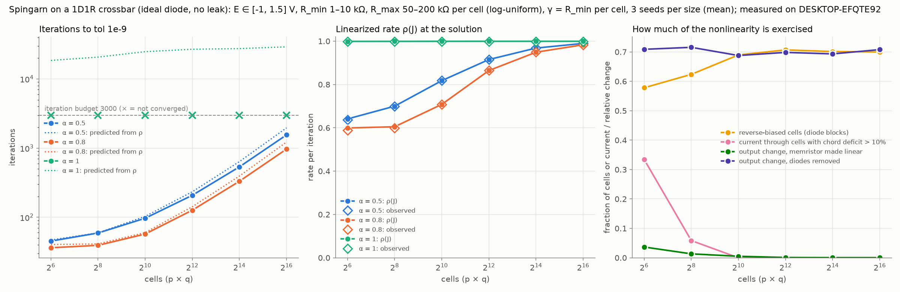
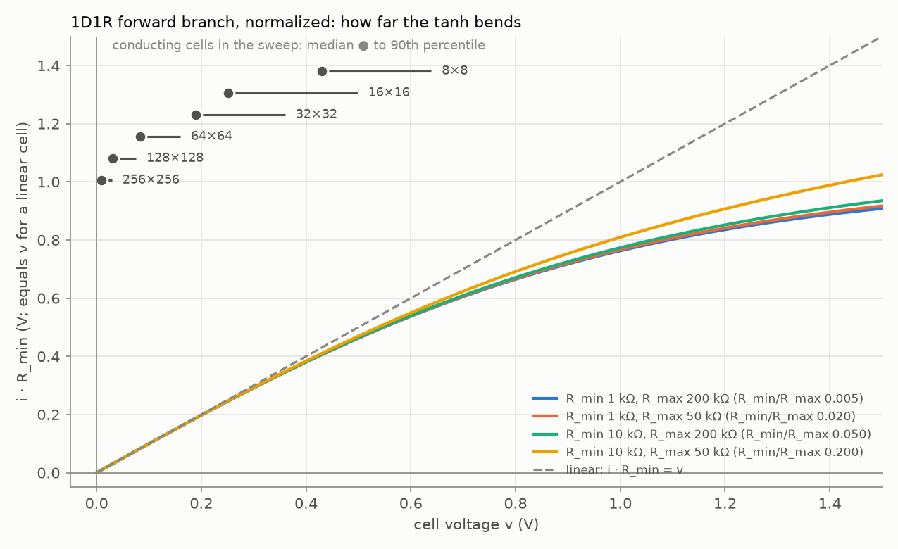
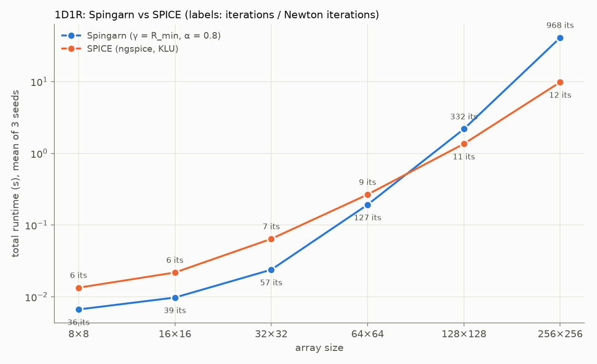
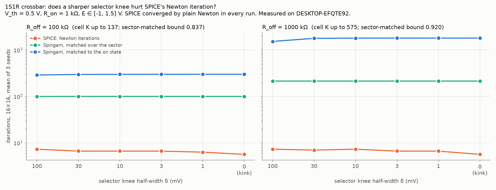
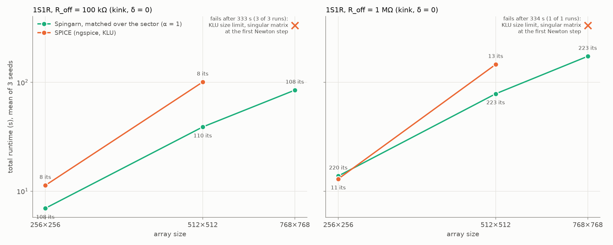

# Non-smooth cells in the crossbar: 1D1R and 1S1R

*2026-10-09. Covers what was added after [report.md](report.md): per-cell resistances, two non-smooth cell types (a diode or a threshold selector in series with each memristor), the experiments run on them, and how Spingarn compares with SPICE on each. The algorithm itself is described in report.md §1 and is not repeated here.*

*Every measurement was made on the PC (DESKTOP-EFQTE92: Intel i5-11600KF, 6 cores, 31.8 GB RAM). Runtimes are comparable within this report and with report.md §7, not with report.md §3–6.*

## Summary

- **Per-cell resistances and two non-smooth cell types are implemented** in the circuit model, the Spingarn solver and the SPICE netlist (§1). Newton, Spingarn and SPICE agree on every circuit checked, and all 45 tests pass (12 of them new).
- **1D1R (ideal diode, no leak): Spingarn converges only with α < 1, and its iteration count grows with size (§2).**
  - α = 1 never converges: the linearized iteration has eigenvalues at −0.999.
  - At α = 0.8 the count grows from 36 iterations at 8×8 to ~970 at 256×256.
  - The linearized spectrum predicts the observed rate to 4 digits. The slow mode lives on rows whose cells are all reverse-biased.
  - Matching those cells as open circuits (an oracle check, not an algorithm) restores ~30 iterations at every size tested.
- **SPICE handles the diode easily (§2.6).** It converges by plain Newton in 6–12 iterations, is faster than Spingarn from 128×128 up (4.2× at 256×256), and is more accurate.
- **At large sizes the 1D1R circuit exercises the diode's kink but not the memristor's tanh (§2.5).** Conducting cells sit at tens of millivolts. From 64×64 up, making the memristors linear changes the outputs by under 0.1%, while removing the diodes changes them by ~70%.
- **1S1R: a sharper selector knee does not hurt SPICE (§3.2).** All the way down to an exact kink, SPICE converges by plain Newton in 3–9 iterations with no fallbacks. Spingarn's count (~100 or ~215, depending on R_off) doesn't depend on the knee either, as its bound predicts.
- **At scale, Spingarn beats SPICE on 1S1R at matched accuracy (§3.3).**
  - At 512×512 it is 2.6× faster with R_off = 100 kΩ and 1.9× faster with R_off = 1 MΩ. The crossover is around 256×256.
  - Spingarn's iteration count is flat in size, while SPICE's Newton count grows from 8 to 14.
  - At 768×768 SPICE fails: it hits the KLU size limit of report.md §7.4, earlier than before because the 1S1R matrix is larger. Spingarn solves it in 85 s or 174 s.
- **Which solver wins comes down to two things (§4).**
  - Nonlinearity that widens a cell's range of incremental resistance costs Spingarn iterations, but barely affects Newton unless it breaks Newton outright.
  - Spingarn wins when its cheap iterations, against a single factorization, outweigh SPICE's repeated refactorizations: at large sizes, with a bounded iteration count.
- **Amortizing one-time costs over many inputs doesn't favour Spingarn by itself (§4.3).** SPICE's one-time costs (netlist loading, KLU reordering) are a larger share of its runtime than Spingarn's factorization is of Spingarn's.

## 1. Model and code changes



*Figure 1. The cell types.*
- *(a) The memristor alone and the 1D1R cell, for a typical cell.*
- *(b) The selector's incremental conductance for four knee widths δ.*
- *(c) The 1S1R cell's current on a log scale for both selector strengths, against the memristor alone. All curves are odd in v; (c) shows v > 0.*

### 1.1 Per-cell resistances

- **Ranges.** `Config(R_min=(lo, hi), R_max=(lo, hi))` gives every cell its own R_min and R_max, drawn log-uniformly from the ranges. A single value gives every cell that value, as before (defaults 1 kΩ and 100 kΩ). The ranges may not overlap, so R_min ≤ R_max in every cell.
- **Reproducibility.** The draws happen after the source voltages E, so with fixed resistances a seed produces exactly the circuit it always did, including every circuit behind report.md.
- **Values used here.** R_min 1–10 kΩ, read as one decade of programmed weights, and R_max 50–200 kΩ.
- **What the law represents.** The tanh law is a static, read-mode law: a memristor at a fixed internal state. R_min is its zero-bias incremental resistance (the programmed weight), and R_max the high-bias asymptote.

### 1.2 1D1R cell

- **The law.** An ideal diode in series with the memristor, treated as one branch: $i = g_m(\max(v, 0))$, where $g_m(v) = v/R_{max} + (1/R_{min} - 1/R_{max})\tanh v$. A reverse-biased cell is an open circuit. The law is monotone but flat for v < 0, with a kink at v = 0, so its incremental resistance ranges over $[R_{min}, \infty]$.
- **Why one branch.** Incremental resistances add in series, so the cell's never drops below R_min. A diode on a branch of its own would reflect its wave completely in both states ($b = -|a|$), whatever its port resistance.
- **Spingarn's per-cell solve.** For an incident wave $a \le 0$ the cell is open and $v = a$. Otherwise the solve is the memristor's, unchanged.
- **SPICE.** The behavioural source is applied to `uramp(V)`, which is max(V, 0).
- **Contraction bound.** It is exactly 1, because an open cell reflects its wave with factor +1 whatever its port resistance. Convergence is then guaranteed only for α < 1 (the Krasnosel'skii–Mann theorem), and with no rate.

### 1.3 1S1R cell

- **The selector.** It is symmetric. Its conductance is $1/R_{off}$ for $|v_s| \le V_{th} - \delta$ and $1/R_{on}$ for $|v_s| \ge V_{th} + \delta$, ramping linearly in between:

  $g_s(v) = v/R_{off} + (1/R_{on} - 1/R_{off})\,[r_\delta(v - V_{th}) - r_\delta(-v - V_{th})]$

  Here $r_\delta$ is the ramp max(x, 0), rounded quadratically over |x| < δ. δ = 0 gives an exact kink at $|v_s| = V_{th}$ (Figure 1b).
- **Why not a logistic (softplus) smoothing.** Its exponential tail leaks current far below threshold, so δ would change the off state as well as the knee. At δ = 100 mV and V_th = 0.5 V, it would cut the zero-bias resistance from 1 MΩ to about 70 kΩ. With the quadratic rounding, δ changes only the knee.
- **The cell.** The selector in series with the memristor, treated as one branch: $i = g_s(v_s) = g_m(v_m)$ with $v = v_s + v_m$. Its incremental resistance lies in $[R_{on} + R_{min},\ R_{off} + R_{max}]$. That range is finite, so the cell is strongly monotone however sharp the knee.
- **Computing the law.** It has no closed form. [devices.py](devices.py) `series_solve` solves a cell for any port resistance γ: γ = 0 gives the law itself, and γ > 0 gives Spingarn's per-cell solve.
  - The unknown is the selector voltage t, which solves $t + g_m^{-1}(g_s(t)) + \gamma g_s(t) = |a|$. The left side is increasing, and the slopes of $g_s$ and $g_m$ give a bracket that provably contains the root.
  - A guarded Newton step (rtsafe) does the solving: the Newton step when it stays in the bracket and at least halves the step before last, bisection otherwise. That converges for any knee, including the kink.
  - $g_m^{-1}$ uses the existing concave-Newton solve, `tanh_root`.
  - Cells leave the iteration as they converge (§3.4).
- **SPICE.** Each cell gets an internal node: a selector source from the word node to it, written with `uramp`, then the memristor source on to the bit node.
- **Values used here.** R_on 1 kΩ, V_th 0.5 V, R_off 100 kΩ or 1 MΩ. The sector ratio is $K = (R_{off} + R_{max})/(R_{on} + R_{min})$. For the worst cell, K ≈ 150 (100 kΩ) or ≈ 600 (1 MΩ), giving a priori bounds of 0.849 and 0.922 with sector matching.

### 1.4 Solver changes

- **Port resistances are per cell.**
  - `"r_lo"` is the low end of the cell's own sector: R_min for memristor and 1D1R cells, and the on state R_on + R_min for 1S1R cells.
  - `"geometric"` is √(r_lo·r_hi) over that sector. A 1D1R cell's sector is unbounded, so it uses the memristor's own range.
  - So `spingarn` (r_lo) and `spingarn_sector` (geometric) keep their report.md meaning on memristor arrays.
- **The contraction bound handles r_hi = ∞,** with a reflection factor of +1.
- **`cell_resolvent` dispatches the per-cell solve by device.** 1S1R cells warm-start from the previous iteration's selector and memristor voltages.
- **The KCL convergence check warm-starts the 1S1R series solve too** (`Config.current` and `kcl_check` accept `x0`). This changes its cost, not its result (§3.4).
- **The device-law code is shared.** It moved to [devices.py](devices.py), used by both `Config` and the solver. `tanh_root` is the old resolvent loop, unchanged. One linear-branch formula was rewritten to stay finite for open cells, so memristor results are unchanged up to rounding.

### 1.5 Verification

- **45 tests pass, 12 of them new.** They cover:
  - an independent restatement of each law, with nested bisection for the 1S1R cell;
  - the series solve over 4000 inputs across knee widths, port resistances and warm starts;
  - Spingarn and SPICE against an independent Newton solve, on 1D1R and 1S1R circuits with both a rounded knee and the kink;
  - KCL written from the circuit description;
  - per-cell parameter draws and round trips.
- **In every experiment below Spingarn and SPICE agree:** to ≤ 1e-7 V on 1D1R circuits and to ~1e-9 V on 1S1R circuits.

## 2. 1D1R experiments

### 2.1 Setup

- **Circuit.**
  - 1D1R cells with E ∈ [−1, 1.5] V. The inputs are signed so that some cells are reverse-biased.
  - R_min 1–10 kΩ and R_max 50–200 kΩ per cell.
  - Wires 5 Ω, sources 50 Ω and loads 1 kΩ, unchanged from report.md.
- **Spingarn settings.** γ = R_min per cell, tol 1e-9, α ∈ {0.5, 0.8, 1}, a budget of 3000 iterations.
- **Sweep.** Sizes 8×8 to 256×256 with seeds 0–2, run by [diode_experiment.py](diode_experiment.py) into `results/diode-sweep-1`. Its runtimes are single in-process timings.
- **Linearized rate.** At the solution the iteration is linear with matrix $J = (1-\alpha)I + \alpha S D$, where D holds each branch's reflection factor.
  - With γ = R_min we have D ≥ 0, so S·D is similar to the symmetric matrix $D^{1/2}\tilde S D^{1/2}$ and has real eigenvalues.
  - Lanczos finds the extreme ones, $\lambda_{min}$ and $\lambda_{max}$, without forming any matrix. Then $\rho(J) = \max|1 - \alpha + \alpha\lambda|$ over the two.
  - This was checked against a dense eigendecomposition at 3×4 and 8×8, agreeing to ~1e-15.

### 2.2 α = 1 does not converge

- **No run converged within 3000 iterations at any size.** $\lambda_{min}$ is −0.99885 at 8×8 and −0.99929 at 256×256, so ρ(J) at α = 1 is 0.9989–0.9993.
- **The mechanism.**
  - A reverse-biased cell carries no current, so it reflects its wave with factor +1 (b = a).
  - Seen from that cell, the rest of the network is nearly a short: a few ohms of wire, against the cell's port resistance of 1–10 kΩ. That reflects with factor ≈ −1.
  - The wave bounces between the two with alternating sign, which gives an eigenvalue near −1. Its eigenvector lies entirely on reverse-biased cells (checked at 3×4 and 8×8).
- **The structure rules out an eigenvalue of exactly −1, but nothing keeps one away from it.** Each node touches only one cell, so no current loop runs through cells alone.
- **Averaging fixes this end of the spectrum.** With α < 1, λ = −1 maps to 1 − 2α: zero at α = 0.5.

### 2.3 Iterations grow with size

| size | iterations, α = 0.5 | iterations, α = 0.8 | $\lambda_{max}$ | ρ(J), α = 0.5 (observed) | ρ(J), α = 0.8 (observed) | best α → rate |
|---|---|---|---|---|---|---|
| 8×8 | 39–49 | 35–37 | 0.20–0.34 | 0.641 (0.637) | 0.599 (0.589) | 0.74 → 0.47 |
| 16×16 | 51–73 | 37–42 | 0.32–0.52 | 0.700 (0.700) | 0.605 (0.600) | 0.77 → 0.54 |
| 32×32 | 90–102 | 53–60 | 0.61–0.65 | 0.8176 (0.8176) | 0.7082 (0.7082) | 0.85 → 0.69 |
| 64×64 | 206–210 | 125–128 | 0.83 | 0.9152 (0.9152) | 0.8643 (0.8643) | 0.92 → 0.84 |
| 128×128 | 525–552 | 325–342 | 0.935–0.938 | 0.9680 (0.9680) | 0.9489 (0.9489) | 0.97 → 0.94 |
| 256×256 | 1510–1581 | 941–986 | 0.978–0.980 | 0.9895 (0.9895) | 0.9832 (0.9832) | 0.99 → 0.98 |

*Ranges are over seeds 0–2; ρ is the mean. "Best α" minimizes ρ(J) for the measured spectrum: $\alpha^* = 2/(2 - \lambda_{min} - \lambda_{max})$.*

- **The spectrum explains the counts completely.** From 32×32 up, the linearized rate equals the observed rate to 4 digits.
- **The slow end is $\lambda_{max} \to 1$.** For seed 0 at 16, 32, 64 and 128, $\lambda_{max}$ is 0.359, 0.612, 0.833 and 0.935. Its eigenvector lies entirely on cells, and the rows carrying most of its weight are rows whose cells are all reverse-biased. 1 − $\lambda_{max}$ shrinks 1.7–3× each time the side doubles.
- **The mechanism.** The network solve models each open cell by its port resistance, R_min. On a row of open cells, q such resistors in parallel to the bit lines swamp the 50 Ω source. Each iteration therefore corrects the row's potential by only a small share, and the more cells per row, the smaller the share.
- **α only fixes the −1 end.** It can't help the +1 end, so the best achievable rate still tends to 1: 0.47 at 8×8, 0.98 at 256×256.



*Figure 2. 1D1R, γ = R_min.*
- *Left: iterations to tol 1e-9 for each α; dotted lines are the predictions from ρ(J); crosses mark runs that hit the 3000-iteration budget.*
- *Middle: ρ(J) from the spectrum (filled) against the observed rate (open).*
- *Right: how much of the nonlinearity is exercised (§2.5).*

### 2.4 Oracle matching

As a one-off check, the cells that end up reverse-biased were given a port resistance of 10⁶ Ω, keeping γ = R_min everywhere else. That uses knowledge of the solution. The spectrum was then recomputed (seed 0):

| size | $\lambda_{max}$, γ = R_min | $\lambda_{max}$, oracle | ρ(J) at α = 0.5, oracle | iterations to 1e-9 (predicted) |
|---|---|---|---|---|
| 32×32 | 0.612 | 0.0153 | 0.508 | ~31 |
| 64×64 | 0.833 | 0.0072 | 0.504 | ~30 |
| 128×128 | 0.935 | 0.0045 | 0.502 | ~30 |

- **The size dependence disappears.** $\lambda_{min}$ moves to −0.99999, since open cells now see a near-short network with γ ≫ R_th, but α = 0.5 maps that to ~0. For this spectrum the best α is about 2/3, giving a rate of ~0.33, or ~19 iterations.
- **So the growth with size is a matching problem, not a consequence of the kink.**
- **The oracle is not an algorithm.** Cell states aren't known in advance. The practical version is adaptive (SIM-style) re-matching with an occasional refactorization, which isn't implemented; you parked it for now.
- These spectra came from an ad hoc script and are not saved under `results/`.

### 2.5 Is the nonlinearity exercised?

| size | reverse-biased cells | conducting cells' voltage: median / p90 | chord deficit, p90 | current through cells with deficit > 10% | output change, memristor made linear | output change, diodes removed |
|---|---|---|---|---|---|---|
| 8×8 | 58% | 0.43 / 0.64 V | 11% | 33% | 3.7% | 71% |
| 16×16 | 62% | 0.25 / 0.50 V | 7.4% | 6% | 1.3% | 72% |
| 32×32 | 69% | 0.19 / 0.36 V | 3.9% | 0% | 0.5% | 69% |
| 64×64 | 71% | 0.083 / 0.16 V | 0.8% | 0% | 0.1% | 70% |
| 128×128 | 70% | 0.031 / 0.075 V | 0.2% | 0% | 0.04% | 69% |
| 256×256 | 70% | 0.009 / 0.029 V | 0.0% | 0% | 0.03% | 71% |

- **Definitions.**
  - *Chord deficit* is $1 - (i/v)R_{min}$: how far a conducting memristor's chord conductance has fallen below its zero-bias value. It is about v²/3 for small v.
  - *Output change* is the relative change in the bit-line output currents when the same circuit is re-solved with the memristors made linear at R_min, or with the diodes removed. Across seeds the diodes' effect ranges from 52% to 109%.
- **The cause is loading.** 50 Ω sources and 1 kΩ loads face 1–10 kΩ cells. As the array grows, word lines sag and bit lines float up, so conducting cells see ever smaller voltages.
- **The consequence:** from 64×64 up this circuit tests the diode's kink, not the tanh. To exercise the tanh at scale, the circuit needs lower-impedance drivers and loads or higher-resistance cells, checked with these same diagnostics.



*Figure 3.* 
- *The 1D1R forward branch, normalized by each cell's zero-bias conductance, for the four corner cells of the resistance ranges. A linear cell would follow the dashed diagonal.*
- *The bars show where the conducting cells actually sit at each size (median to 90th percentile, mean over seeds). From 64×64 up they are in the straight part of the curve.*

### 2.6 Against SPICE

**Setup.**
- The experiment runner, with each run in its own process.
- The same circuits as §2.3 (seeds 0–2).
- Spingarn at α = 0.8 and tol 1e-9; SPICE at RELTOL 1e-3 with KLU.
- Results in `results/diode-spice-1`.

| size | Spingarn | SPICE | faster |
|---|---|---|---|
| 8×8 | 0.007 s (36 iterations) | 0.013 s (6 Newton iterations) | Spingarn 2.0× |
| 16×16 | 0.010 s (39) | 0.022 s (6) | Spingarn 2.2× |
| 32×32 | 0.024 s (57) | 0.064 s (7) | Spingarn 2.7× |
| 64×64 | 0.19 s (127) | 0.27 s (8.7) | Spingarn 1.4× |
| 128×128 | 2.18 s (332) | 1.36 s (10.7) | SPICE 1.6× |
| 256×256 | 41.0 s (968) | 9.8 s (12.3) | SPICE 4.2× |

- **SPICE used plain Newton in every run.** Its Newton count grows slowly with size, from 6 to 12, against Spingarn's ~27-fold growth over the same range.
- **Spingarn's 256×256 runtimes vary:** 28.8, 46.5 and 47.6 s for near-identical iteration counts. All the extra time is in the iteration loop (30 versus 48 ms per iteration), and the cause is unknown. The in-process sweep (§2.3) measured ~29 s for all three seeds.
- **Accuracy is not matched, and the mismatch favours SPICE.** On nodes that carry current, the worst relative KCL residual is:
  - SPICE: 2e-11 at 16×16, 2e-11 at 64×64, 1e-9 at 256×256;
  - Spingarn: 3e-9, 1e-7 and 3e-6.

  Newton overshoots its tolerance, while Spingarn stops as soon as its KCL test passes. At small-current nodes that test is governed by its absolute tolerance, 1e-12 A. Matching SPICE's accuracy would cost Spingarn more iterations.
- **Spingarn's recorded `kcl_residual_rel` of 0.6–0.97 is a metric artifact.**
  - 27–36% of nodes sit on dead lines (every cell off) and carry under 1 nA.
  - There the relative residual is residual ÷ max(scale, abstol), which comes out at about 1 for a residual of 1e-12 A.
  - Spingarn's absolute residuals are all ≤ 1.0e-12 A, so its runs passed the test legitimately.



*Figure 4. 1D1R: total runtime against size, Spingarn (γ = R_min, α = 0.8) against SPICE. Labels give iterations and Newton iterations; mean of 3 seeds.*

## 3. 1S1R experiments

### 3.1 Setup

- **Circuit.** As §2.1, with 1S1R cells: R_on 1 kΩ, V_th 0.5 V, R_off 100 kΩ or 1 MΩ.
- **Spingarn's main variant** is `spingarn_sector`: each cell matched over its whole sector, at α = 1. This is the matching with the a priori, size-independent bound.
- **§3.2 also runs `spingarn`**, which matches each cell to its on state (γ = R_on + R_min).

### 3.2 Does a sharper knee hurt Newton?

**Setup.**
- [selector_feasibility.py](selector_feasibility.py), results in `results/selector-feasibility-1`.
- In-process solves at 1×1 and 16×16, seeds 0–2.
- Knee half-width δ from 100 mV down to 0.

At 16×16 (ranges over seeds):

| δ | R_off 100 kΩ: SPICE / Spingarn (sector) / Spingarn (on state) | R_off 1 MΩ: SPICE / Spingarn (sector) / Spingarn (on state) |
|---|---|---|
| 100 mV | 7–8 / 95–104 / 251–315 | 7–8 / 209–219 / 1160–1729 |
| 30 mV | 6–7 / 95–105 / 279–313 | 6–8 / 209–219 / 1656–1871 |
| 10 mV | 6–7 / 95–105 / 283–319 | 6–8 / 209–219 / 1664–1889 |
| 3 mV | 6–7 / 95–105 / 283–320 | 6–8 / 209–219 / 1665–1891 |
| 1 mV | 6–7 / 95–105 / 284–320 | 5–9 / 209–219 / 1666–1891 |
| 0 (kink) | 5–6 / 95–105 / 284–320 | 5–6 / 209–219 / 1666–1891 |

*SPICE: Newton iterations. Spingarn: iterations.*

- **SPICE used plain Newton in every run,** at 1×1 as well (3–6 iterations), with no trend in δ. The hypothesis that a sharp knee would hurt Newton is rejected for this cell; §4.1 explains why.
- **Spingarn with sector matching doesn't depend on δ either,** as its bound predicts: 0.837–0.843 for R_off = 100 kΩ and 0.920 for 1 MΩ. On-state matching is 3–9× slower, because off cells are then badly mismatched.
- **The knee was exercised.** At 16×16, 34–77% of selectors conduct and 1–12% sit within 10 mV of V_th.
- **The solutions agree** to ≤ 1.4e-9 V.



*Figure 5. 1S1R at 16×16: iterations against the selector's knee half-width, down to the exact kink, for both selector strengths. SPICE: Newton iterations. Spingarn: iterations, matched over the sector or to the on state.*

### 3.3 At scale

**Setup.**
- The experiment runner, with each run in its own process and a 40-minute timeout.
- Seeds 0–2, δ = 0, sizes 256, 512 and 768.
- `spingarn_sector` against SPICE.
- Results in `results/selector-scale-Roff100000` and `results/selector-scale-Roff1000000`.

| size | R_off 100 kΩ: Spingarn | SPICE | faster | R_off 1 MΩ: Spingarn | SPICE | faster |
|---|---|---|---|---|---|---|
| 256×256 | 6.96 s (108–109 iterations) | 11.3 s (8 Newton) | Spingarn 1.6× | 13.8 s (218–223) | 13.0 s (10–11) | SPICE 1.06× |
| 512×512 | 38.9 s (109–112) | 100.6 s (8) | Spingarn 2.6× | 78.5 s (223–224) | 146.0 s (12–14) | Spingarn 1.9× |
| 768×768 | 84.7 s (108–109) | fails (3 of 3) | — | 173.5 s (221–224) | fails (1 of 1) | — |

- **Spingarn's iteration count is flat in size.** It sits at its sector bound: 0.849 and 0.922 at these sizes. SPICE's Newton count grows with both size and R_off, from 8 to 14.
- **Per iteration, Spingarn costs 62, 348 and 772 ms** at 256, 512 and 768: roughly linear in cells. SPICE's cost per Newton iteration grows faster. At 512×512 it spends 53.6 s factorizing over 8 Newton iterations (100 kΩ) and 98.3 s over 12–14 (1 MΩ). That's about 6.7–7.6 s per factorization, against 3.1 s on the memristor-only array at the same size.
- **Memory.** Spingarn peaks at 0.23, 0.63 and 1.31 GB. SPICE peaks at 1.32 and 5.18 GB, and reached ~9.9 GB before failing at 768.
- **Accuracy is matched.** Every node carries some current here, through the selectors' off resistance. Over all nodes, the worst relative KCL residual is 4e-10 to 7e-9 for Spingarn and 9e-11 to 1.1e-8 for SPICE. The solutions agree to ~1.2e-9 V.
- **How SPICE fails at 768×768:**
  - "singular matrix" at the first Newton step, and the numeric factorization never runs (factor time 0);
  - every fallback then fails (gmin stepping, source stepping, transient ramp), after ~333 s.

  This is the same signature as the memristor-only failure at 1024×1024 (report.md §7.4): the KLU size limit, not Newton failing on the selector. It arrives earlier because the 1S1R matrix has 1.77M equations (an extra node per cell) against 1.18M for the memristor-only 768×768 array. Its factorization work is also about twice as large, judging by the 512×512 timings above.
- **One SPICE run at 1 MΩ.** After the first 768×768 failure you chose to skip the remaining runs at that size, but one 1 MΩ run had already started by then.



*Figure 6. 1S1R at scale (kink, δ = 0): total runtime against size, Spingarn (sector matching) against SPICE, for both selector strengths. Labels give iterations and Newton iterations; crosses mark SPICE's failures, at their time to failure.*

### 3.4 Two efficiency fixes before the final runs

Both remove overhead that would otherwise have been charged to Spingarn's method. Neither changes any result: iteration counts are identical, and the tests pass.

- **Warm-started KCL check.**
  - Spingarn's convergence test evaluates every cell's current at the latest node potentials. For 1S1R cells that's a full series solve, which used to start cold each iteration: ~146 ms at 256×256, measured on synthetic inputs.
  - It now starts from the iterate's current cell states and takes 35 ms.
  - An instrumented in-process run at 256×256 (R_off 1 MΩ) then spent 79 ms per iteration: 25 ms in the cell solve, 35 ms in the KCL check, 20 ms in the rest.
- **Retiring converged cells.**
  - The vectorized cell solve used to iterate the whole array until its slowest cell converged. With more cells the slowest cell needs more steps: 1.7 per iteration at 256×256, but 5.4 and 12.8 at 512×512 (seeds 0 and 1). That made an iteration cost 911 and 1482 ms.
  - Cells now leave the iteration as they converge. At 512×512 that gives 348 ms per iteration (130 ms cell solve, 139 ms KCL check, 79 ms rest), and the total drops from 101 s to 39 s.
  - The slow runs are kept in `results/selector-scale-Roff100000/unoptimized/`.

## 4. What decides which solver wins

### 4.1 Why kinks don't hurt Newton

- **The Jacobian never becomes singular.** On a monotone resistive network, Newton's Jacobian $A\,G(u)A^T$ with G ≥ 0 is positive semidefinite. The wires, sources and loads make it positive definite even when every cell is off.
- **The kinks are benign.** With bounded slopes on each piece, Newton on a piecewise-linear monotone law acts like an active-set method: each step decides which cells conduct and solves the resulting linear network, and a few re-sorting steps settle it. The 1D1R kink joins a flat piece to a gentle one; the 1S1R knee joins slopes 1/R_off and 1/R_on.
- **What does break Newton:**
  - exponential growth: overshoot without junction-voltage limiting, which behavioural sources don't get;
  - near-singular Jacobians, such as nodes connected only through cells that are off;
  - non-monotone laws (negative resistance, snapback), which are outside Spingarn's theory as well.

### 4.2 What costs Spingarn iterations

Spingarn's rate depends on how well one fixed port resistance per branch fits that branch's incremental resistance over its operating range. Matched over the sector, the bound is $(\sqrt K - 1)/(\sqrt K + 1)$. Newton re-linearizes at every step instead.

| cell | Spingarn iterations | SPICE Newton iterations | at the largest size SPICE runs | beyond |
|---|---|---|---|---|
| memristor (report.md §7), γ = R_min | 5, flat | 4, flat | Spingarn 57× faster (768×768) | SPICE fails at 1024×1024 |
| 1D1R, γ = R_min, α = 0.8 | 36 → 968, grows with size | 6 → 12 | SPICE 4.2× faster (256×256) | not run |
| 1S1R, R_off 100 kΩ, sector (K ≈ 150) | ~110, flat | 8 | Spingarn 2.6× faster (512×512) | SPICE fails at 768×768 |
| 1S1R, R_off 1 MΩ, sector (K ≈ 600) | ~220, flat | 10–14 | Spingarn 1.9× faster (512×512) | SPICE fails at 768×768 |

Widening each cell's range of incremental resistance cost Spingarn 20–200× more iterations, while SPICE's Newton count grew 2–3×. Spingarn still wins where its count stays bounded and the array is large enough for SPICE's refactorizations to dominate.

### 4.3 One-time costs and many inputs

**The question.** You proposed comparing a single input with Spingarn's factorization left out, since over n inputs the factorization's share per input goes to zero as n → ∞. For that to be fair, SPICE's one-time costs have to be left out too:
- loading the netlist;
- KLU's reordering, if ngspice can reuse it across inputs (not tested).

On the memristor-only array, using the report.md §7 runs:

| size | totals | SPICE total ÷ Spingarn's iterations | SPICE analysis without reordering ÷ Spingarn's iterations | SPICE analysis ÷ Spingarn's iterations (reordering for every input) |
|---|---|---|---|---|
| 256×256 | 20× | 36× | 11× | 18× |
| 512×512 | 35× | 65× | 25× | 48× |
| 768×768 | 57× | 107× | 46× | 90× |

*At 768×768, SPICE's 145 s comprise 16 s loading the netlist, 60 s reordering and 55 s factorizing over 4 Newton iterations. Spingarn's 2.5 s comprise 1.1 s of setup, 0.88 s of it the factorization, and 1.36 s of iterations.*

- **On 1S1R, with the same fair metric,** Spingarn is 1.6× (100 kΩ) and 1.4× (1 MΩ) faster at 512×512, while SPICE is 1.4× and 2.0× faster at 256×256. Spingarn's setup is ~1 s against minutes of iterations, so amortization barely helps it.
- **Leaving out only Spingarn's one-time cost roughly doubles its apparent advantage.** Leaving out both shrinks it, unless ngspice has to reorder for every input.
- **What could still favour Spingarn over many inputs** is solving several at once as multiple right-hand sides, which SPICE can't do. That's untested.

## 5. Limitations

- **Measurements.**
  - One machine (the PC) and three seeds per configuration.
  - §2.3's runtimes are single in-process timings; §2.6 and §3.3 are isolated runner runs.
- **SPICE's failures are an implementation limit.** The failures at 768×768 (1S1R) and 1024×1024 (memristor-only) are a KLU size limit in the ngspice-47 Windows build. A build with 64-bit KLU, or another simulator such as Xyce, would show whether SPICE merely becomes slow.
- **The device models are idealized.**
  - The tanh memristor is a static, read-mode law whose conductance falls with voltage. Oxide RRAM read currents typically rise faster than linearly (sinh-like). In these circuits the tanh is also barely exercised at scale (§2.5).
  - The selector is monotone and symmetric, with no snapback. Real threshold switches (OTS, NbO₂) snap back.
  - The ideal diode has no leak. A leak would make the sector finite, but the bound would be nearly useless: about 0.998 for γ = 1 kΩ and a 1 MΩ leak.
- **Accuracy is matched for 1S1R but not for 1D1R,** where SPICE is more accurate (§2.6).
- **Some numbers aren't saved under `results/`.** The oracle-matching spectra (§2.4) and the location of the slow 1D1R mode come from ad hoc scripts.
- **There is no frozen-Jacobian baseline.** With γ = R_min, Spingarn's matrix equals Newton's Jacobian at zero bias, so the chord method (Newton with its Jacobian frozen) also factorizes only once. Whether Spingarn beats it hasn't been measured.

## 6. Next steps

1. **A chord-method baseline (Newton with a frozen Jacobian).** On memristor-only arrays, with cells near zero bias, it may match Spingarn. On 1S1R its worst-case rate of 1 − 1/K (0.998) against Spingarn's 0.92 should separate the two. This is needed before attributing the speedups to Spingarn's method rather than to factorizing once.
2. **Adaptive matching (parked).** Re-match cells to their current state, with an occasional refactorization. The oracle check (§2.4) suggests ~30 iterations at any size on 1D1R.
3. **sinh-like memristors (deferred).** Exponential read currents are where Newton could genuinely struggle. But the sector ratio K ≈ cosh(E_max/V₀) grows fast, so Spingarn's bound may be weak there.
4. **Exercising the tanh at scale.** Lower-impedance drivers and loads, or higher-resistance cells, checked with the §2.5 diagnostics.
5. **Spingarn's cost per iteration on 1S1R.** The KCL check is still ~40% of an iteration. Batching several inputs at once is the other open lever.

## 7. Reproduction

```
python diode_experiment.py --sizes 8 16 32 64 128 256 --seeds 3 --max-iter 3000 --out results/diode-sweep-1
python run_experiments.py --sizes 8 16 32 64 128 256 --runs 3 --algorithms spingarn spice --options '{"spingarn": {"alpha": 0.8}}' --circuit '{"device": "1d1r", "E_range": [-1, 1.5], "R_min": [1000, 10000], "R_max": [50000, 200000]}' --out results/diode-spice-1
python selector_feasibility.py --out results/selector-feasibility-1
python run_experiments.py --sizes 256 512 768 --runs 3 --algorithms spingarn_sector spice --timeout 2400 --circuit '{"device": "1s1r", "E_range": [-1, 1.5], "R_min": [1000, 10000], "R_max": [50000, 200000], "R_on": 1000, "R_off": 100000, "V_th": 0.5, "delta": 0}' --out results/selector-scale-Roff100000
python run_experiments.py --sizes 256 512 768 --runs 3 --algorithms spingarn_sector spice --timeout 2400 --circuit '{"device": "1s1r", "E_range": [-1, 1.5], "R_min": [1000, 10000], "R_max": [50000, 200000], "R_on": 1000, "R_off": 1000000, "V_th": 0.5, "delta": 0}' --out results/selector-scale-Roff1000000
python report_nonsmooth_figures.py
```

- **How the 1S1R sweeps were actually run.** They went through `run_experiments.run_sweep`, in phases. Spingarn was rerun after the fixes of §3.4, and the SPICE runs already recorded were kept. The commands above reproduce the same configurations in one pass each, including the SPICE runs at 768×768 that were skipped.
- **Figures.** [report_nonsmooth_figures.py](report_nonsmooth_figures.py) writes every figure to `report_assets/nonsmooth/`. Figure 1 comes from the device laws; the rest come from the result directories above.

**Files changed**

| file | change |
|---|---|
| [devices.py](devices.py) (new) | memristor and selector laws; `tanh_root` (moved from the solver, unchanged); `series_solve` for 1S1R cells |
| [Config.py](Config.py) | per-cell R_min/R_max ranges; `device` ∈ {memristor, 1d1r, 1s1r} and the selector parameters; each device's sector; currents and conductances through devices.py; warm start `x0` |
| [algorithms/spingarns.py](algorithms/spingarns.py) | per-cell port resistances over each cell's sector; `reflection()`; the bound for an infinite sector; `device_resolvent` through `tanh_root`, with the diode option; `cell_resolvent`; warm-started KCL check |
| [algorithms/common.py](algorithms/common.py) | `kcl_check` accepts a warm start |
| [algorithms/spice.py](algorithms/spice.py) | per-cell coefficients; `uramp` for 1D1R; internal node and selector source for 1S1R |
| [convergence_rates.py](convergence_rates.py) | per-cell and device-aware |
| [diode_experiment.py](diode_experiment.py) (new) | 1D1R α sweep, Lanczos spectrum, operating-point diagnostics |
| [selector_feasibility.py](selector_feasibility.py) (new) | 1S1R knee-sharpness check |
| [report_nonsmooth_figures.py](report_nonsmooth_figures.py) (new) | this report's figures |
| [testing/test_config.py](testing/test_config.py), [test_spingarn.py](testing/test_spingarn.py), [test_spice.py](testing/test_spice.py) | 12 new tests |
